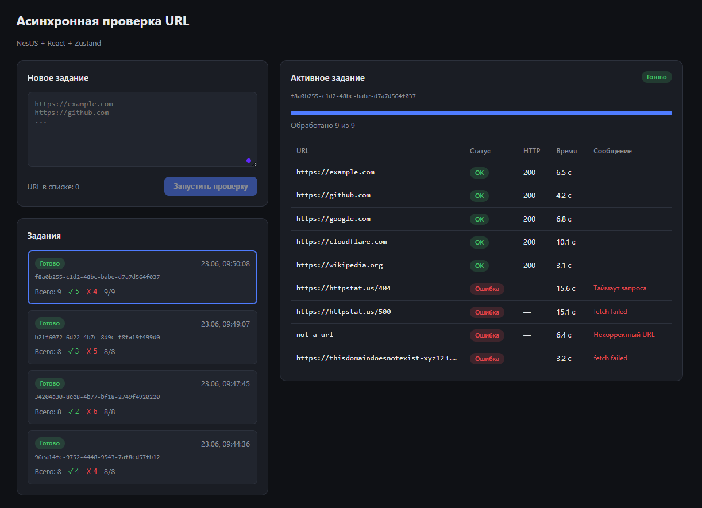

# Демонстрация



# Асинхронная проверка списка URL

REST API на **NestJS + TypeScript** и фронтенд на **React + TypeScript + Zustand**
для асинхронной проверки списка URL.

# Возможности

- Создание задания на проверку списка URL.
- Асинхронная обработка в фоне: для каждого URL выполняется HTTP `HEAD`-запрос.
- Не более **5 одновременных** запросов на одно задание (пул воркеров).
- Перед сохранением результата каждого URL добавляется случайная задержка 0–10 секунд.
- Параллельная обработка нескольких заданий.
- Отмена задания: останавливаются ещё не начатые URL.
- Хранение в памяти (БД не требуется).
- Фронтенд: форма создания, список заданий, детальный просмотр с прогрессом,
  периодический опрос статуса и корректная остановка опроса при смене задания.

# Стек

| Слой      | Технологии                                   |
|-----------|----------------------------------------------|
| Backend   | Node.js 20, NestJS 10, TypeScript            |
| Frontend  | React 18, TypeScript, Zustand, Vite          |
| Запуск    | Docker + docker-compose                      |

# Быстрый старт через Docker

Требуется установленный Docker и docker-compose.

```bash
docker compose up --build
```

После сборки:

- Фронтенд: http://localhost:8080
- API: http://localhost:3000/api/jobs

Nginx во фронтенд-контейнере проксирует запросы `/api` на бэкенд.

# Локальный запуск (без Docker)

Нужен Node.js 20+.

# Бэкенд

```bash
cd backend
npm install
npm run start:dev      # http://localhost:3000
```

# Фронтенд

В отдельном терминале:

```bash
cd frontend
npm install
npm run dev            # http://localhost:5173
```

Vite-сервер проксирует `/api` на `http://localhost:3000`, поэтому бэкенд должен быть запущен.

# API

Базовый префикс: `/api`.

# `POST /api/jobs`

Создаёт задание. Тело запроса:

```json
{ "urls": ["https://example.com", "https://github.com"] }
```

Ответ:

```json
{ "jobId": "2976acf1-1014-486d-a5ef-2baca5075949" }
```

# `GET /api/jobs`

Список заданий (новые сверху) с краткой статистикой:

```json
[
  {
    "id": "…",
    "createdAt": "2026-06-23T06:29:34.242Z",
    "status": "in_progress",
    "total": 4,
    "processed": 1,
    "stats": { "pending": 0, "in_progress": 2, "success": 1, "error": 1, "cancelled": 0 }
  }
]
```

# `GET /api/jobs/:id`

Детальная информация по заданию, включая каждый URL: статус, HTTP-код,
сообщение об ошибке, время начала/окончания и длительность.

# `DELETE /api/jobs/:id`

Помечает задание как `cancelled` и прекращает обработку ещё не начатых URL.

# Статусы

**Задание:** `pending`, `in_progress`, `completed`, `cancelled`, `failed`.

**URL:** `pending`, `in_progress`, `success`, `error`, `cancelled`.

# Структура проекта

```
url-checker/
├── docker-compose.yml
├── backend/
│   ├── Dockerfile
│   └── src/
│       ├── main.ts
│       ├── app.module.ts
│       └── jobs/
│           ├── jobs.controller.ts     # REST-эндпоинты
│           ├── jobs.service.ts        # in-memory хранилище + пул воркеров
│           ├── url-checker.service.ts # HEAD-запрос с таймаутом
│           ├── dto/create-job.dto.ts
│           └── types/job.types.ts
└── frontend/
    ├── Dockerfile
    ├── nginx.conf
    └── src/
        ├── App.tsx
        ├── api/jobs.api.ts            # слой работы с API
        ├── store/jobs.store.ts        # глобальное состояние (Zustand) + опрос
        └── components/
            ├── CreateJobForm.tsx
            ├── JobList.tsx
            └── JobDetail.tsx
```

# Заметки по реализации

- **Параллелизм.** Внутри задания запускается `min(5, число URL)` воркеров,
  каждый берёт следующий URL из общего курсора, пока они не закончатся.
- **Опрос и устаревшие ответы.** Стор хранит `activeJobId`; перед применением
  ответа `GET /jobs/:id` проверяется, что активное задание не сменилось, поэтому
  ответы по старому `jobId` не меняют состояние интерфейса. При смене активного
  задания таймер опроса очищается.
- **Отмена.** При `DELETE` не начатые URL переводятся в `cancelled`, воркеры
  перестают брать новые URL. Уже выполняющиеся запросы завершаются.
